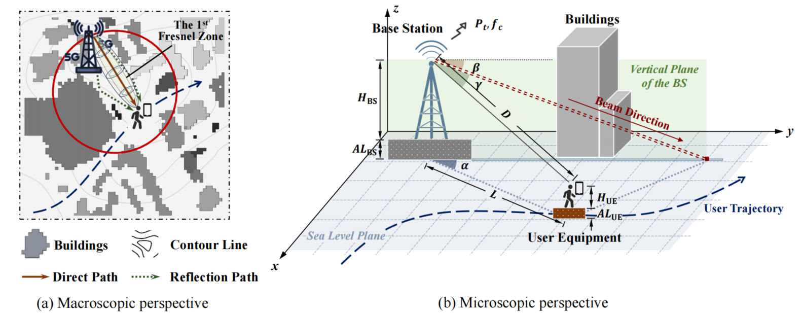
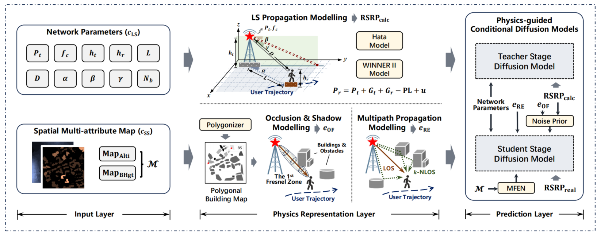
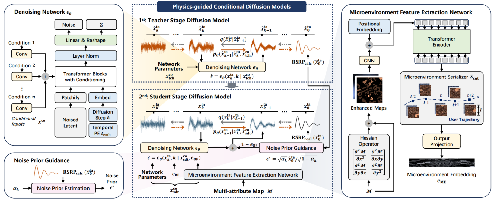
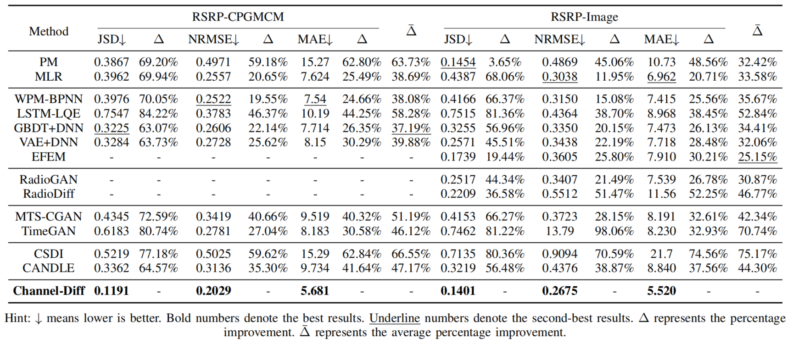

# Channel-Diff

**Physics-guided Diffusion Models for Multi-scale Prediction of Reference Signal Received Power in Wireless Networks**

Xiaoqian Qi, Haoye Chai, Yue Wang, Zhaocheng Wang, and Yong Li

[Overview](#overview) · [Method](#method) · [Training and inference](#training-and-inference) · [Citation](#citation)

Channel-Diff is a physics-guided conditional diffusion model for predicting Reference Signal Received Power (RSRP) along user trajectories. It combines network parameters, urban maps, and propagation physics to capture large-scale attenuation and the conditional statistics of small-scale fading.

## Overview

Wireless signal propagation depends on both the base station–user geometry and the surrounding environment. Channel-Diff models these complementary factors to generate RSRP sequences aligned with a user's movement.



*Figure 1. A typical wireless transmission scenario. (a) The urban environment, user trajectory, direct and reflected paths, and first Fresnel zone. (b) Base station–user geometry, antenna orientation, and terrain and building heights.*

The framework brings together three layers:

- **Input:** network parameters and multi-attribute urban maps containing ground altitude and building height.
- **Physics representation:** large-scale propagation modelling estimates the received-power baseline; occlusion and shadow modelling describe blockage; multipath propagation modelling encodes reflection geometry.
- **Prediction:** conditional diffusion combines these physical representations with local environmental features to generate RSRP sequences.



*Figure 2. Overall framework of Channel-Diff. The input and physics representation layers provide network conditions, calculated RSRP, an occlusion factor, and reflection embeddings. The prediction layer integrates these with microenvironment features through a teacher–student training scheme.*

## Method

Channel-Diff combines a Transformer denoising network with physics-guided two-stage training:

- **Teacher stage:** learn large-scale propagation patterns using RSRP calculated from propagation models.
- **Student stage:** refine the model using measured RSRP, reflection embeddings, and urban microenvironment features.
- **Noise prior guidance:** incorporate the physical baseline into denoising, with guidance modulated by occlusion information.

The **Microenvironment Feature Extraction Network (MFEN)** extracts local context from urban maps. It combines Hessian-based edge enhancement, CNN and Transformer spatial encoding, and a trajectory-aligned serializer to produce a microenvironment embedding for each user position.



*Figure 3. Architecture of the physics-guided conditional diffusion model. Left: conditional denoising and noise prior estimation. Center: teacher-stage learning from calculated RSRP and student-stage learning from measured RSRP. Right: MFEN extracts spatial features and aligns local environmental information with the user trajectory.*

The paper evaluates Channel-Diff against statistical, machine-learning, and generative baselines on RSRP-CPGMCM and RSRP-Image.



*Table 1. Performance comparison from the paper on RSRP-CPGMCM and RSRP-Image. Lower JSD, NRMSE, and MAE indicate better performance. Δ denotes Channel-Diff's relative improvement over each baseline, and the barred Δ denotes the average across the three metrics.*

## Code structure

```text
Channel-Diff/
├── main.py                         # Training and inference entry point
├── models_with_mask_scale.py       # Conditional diffusion Transformer
├── visual_layer.py                 # MFEN and alternative visual encoders
├── Embed.py                        # Signal and positional embeddings
├── DataLoader.py                   # Dataset loading
├── train.py                        # Training and sampling
├── diffusion/                      # Diffusion objectives and samplers
├── Figs/                           # Figures used in this README
└── visualize_examples-gene.ipynb    # Visualization notebook
```

## Training and inference

Run from the `Channel-Diff/` directory with the processed dataset and GPU settings configured in [main.py](main.py).

For two-stage training, set `prompt_state='train'` in `main.py`, then run:

```bash
mkdir -p experiments
python main.py
```

For inference, set `prompt_state='test'` and point `save_folder` to an existing experiment containing the trained student checkpoint. Run the same command to generate RSRP sequences.

Checkpoints and generated samples are saved under `experiments/`. Use [visualize_examples-gene.ipynb](visualize_examples-gene.ipynb) to visualize the generated sequences.

## Citation

Please cite our paper when using Channel-Diff:

> X. Qi, H. Chai, Y. Wang, Z. Wang and Y. Li, "Physics-guided Diffusion Models for Multi-scale Prediction of Reference Signal Received Power in Wireless Networks," in *IEEE Transactions on Mobile Computing*, doi: 10.1109/TMC.2026.3731295.
